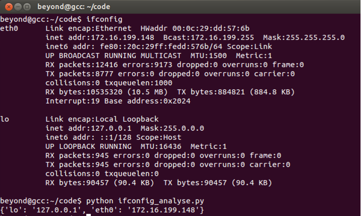

# 360_OPS_writeup

360公司OPS实习生试题\_Writeup

## 基础题

### 1.password_cache

1. ssh-keygen生成相应的公私钥对，默认会在~/.ssh下面：`id_rsa` 和`id_rsa.pub`, 将id\_rsa.pub拷到相应的服务器上就不要再服务密码了。
2. 考虑id\_rsa私钥的安全性，先修改权限chmod 600 ~/.ssh/id_rsa,再将id_rsa拷贝到自己知道的目录下。下次连接的时候用ssh -i 来连接，但是要保证sudo不能查看目前应该是没有办法(个人观点)。**个人建议就是将私钥保存在u盘上，用完就拨掉u盘**

### 2. ifconfig_reg

```python
#!/usr/bin/env python
#coding: utf-8
import os

def ifconfig_hash():
        os.system('ifconfig > /tmp/ifconfig_cache')
        ifconfig_cache=open("/tmp/ifconfig_cache")
        save_hash={}
        for l in ifconfig_cache:
                # 判断第一个不为空且不为空行
                if l[0]!=' ' and l[0]!='\n':
                        # 取网卡
                        key=l.split(' ')[0]
                        l=ifconfig_cache.next()
                        #在取网卡的下一行可以直接读取ip
                        value=l.strip().split(' ')[1].split(':')[1]
                        save_hash[key]=value;
        ifconfig_cache.close();
        os.system('rm /tmp/ifconfig_cache')
        return save_hash

if __name__=='__main__':
        print ifconfig_hash()

```

运行结果如下：




### 4. log_cutting

```bash
# access.log日志切割
#!/bin/bash
mv access.log access_$(date +"%Y%m%d").log
```

保存上面的脚本程序为access_log.sh,并保存到/usr/bin/access_log.sh,接下来设置crontab作业：

```
0 0 * * * bash /usr/bin/access_log.sh
```

每天的0点0分，那个时候应该都睡觉了，会自动保存access日志，并将其日期作为名字的一部分保存。

**缺陷**


